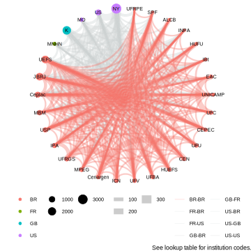
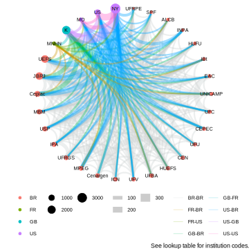

**Senegalia blog**

In 2020 GBIF released a news item "[New data-clustering feature aims to improve data quality and reveal cross-dataset connections](https://www.gbif.org/news/4U1dz8LygQvqIywiRIRpAU/new-data-clustering-feature-aims-to-improve-data-quality-and-reveal-cross-dataset-connections)." Basically, we run an algorithm across datasets shared with GBIF to search for similarities in occurrences data fields such as location, identifiers and dates. Please read this [blog](https://data-blog.gbif.org/post/clustering-occurrences/) by Marie Grosjean and Tim Robertson for more details on how it works. In general, we can identify linkages between specimens, DNA sequences and literature citations.

<!--more-->

As a botanist I see the clustering as an opportunity to investigate patterns of sharing duplicate collections. It is common for plant collectors, like I did before joining GBIF, to collect multiple specimens from large plants, like trees, and to share them broadly. For example, if a collection expedition includes two botanists from different institutions, each may keep a "duplicate." It is also expected that the collectors send a duplicate(s) to a local herbaria in the region where it was collected and to send a duplicates to a major institution(s) in North America or Europe.

Then what happens? These specimens then take a life on of their own. Some are databased and shared with GBIF with specimens imaged and others sequenced. Unfortunately, some herbaria don't have resources to digitize so no information digitally accessible. Of course, it is best to track these data digitally from collection onwards, but we can retroactively put these data together.

Using the current algorithm settings, see below, there are more than 50 million clusters among datasets in GBIF, half of these in Plantae. To make a manageable study I focused on a group I know a bit about and have collected – preserved specimens of _Senegalia_ from Brazil. These pairwise clusters often group together in larger clusters, i.e. the five duplicates from a single tree collection, but for this analysis we are focusing on the similar comparison of pairs.

Many questions could be addressed with this type of data. The following three questions interested me for this blog.

- Did each part of a cluster pair use the same species name?
- Did each part of a cluster pair include the locality latitude and longitude?
- Are there any sharing patterns that would show up in a simple network analysis?

For this blog we used the following clustering settings:

* Location: non conflicting country, same country, non conflicting coordinates, same coordinates, within2km, within200m
* Identifiers: same accepted species, identifiers overlap, same recorder name, same specimen
* Date: samedate, nonconflictingdate, approximatedate

**Name matching**

GBIF matches all incoming names to a taxonomy, the GBIF backbone. We use synonyms to match a name that is not an accepted species in the GBIF backbone. GBIF, and partner, COL, welcome the involvement of your taxonomic expertise. Please see the work the legume community has done ([blog](https://data-blog.gbif.org/post/2022-02-01-the-world-checklist-of-vascular-plants-fabaceae/), [publication](https://doi.org/10.1038/s41597-022-01812-6)). The latest [LPWG taxonomy](https://www.legumedata.org/taxonomy/species-list/) can be found on the legume portal.

For better or worse, _Acacia_ was retypified after the Melbourne International Botanical Congress in 2011. This was the result of earlier phylogenetic work which has now led to the recognition of seven segregate genera, one being _Senegalia_. (Personal note: Most of my phylogenetic work has been in this clade but I was not part of the retypification effort.) _Senegalia_ was an inevitable split from _Acacia_ s.l. regardless of what name it would hold. Some institutions still use the _Acacia_ names (and even some older names) either by choice or because they have not been updated.

This gives us a chance to show that synonyms work and why they are critically important to data aggregation. Lack of synonyms is one GBIF's largest data gaps. Besides the generic names _Senegalia_ and _Acacia_, the older name _Mimosa_ was also found in the dataset. The majority of the pairs both use _Senegalia,_ with nearly 18% only using _Acacia_. Again, despite this use of different genera the synonymy works. There were only six uses of _Mimosa_

At the species epithet level 96% were identical, regardless of whether _Senegalia_ or _Acacia_ was used as the genus. These differences reflect recent species recircumscriptions. Of course, there may be uncaptured clusters in GBIF because we do not have the complete synonymy in our taxonomic backbone.

**Coordinate matching**

Occurrence data with coordinates are more valuable than data without coordinates, they will be reused more and cited more. We deleted any suspected centroids from the dataset. First of all the results indicate that we as a community need to do better and include coordinates in field notes and in the datasets, only 38% of the pairs contained coordinates on both specimens. Of the pairs which both have coordinates, 67% of the time it was an exact match with one-third were rounded on at least one specimen, but still good usable data.

Interestingly 23% of the pairs contained one specimen with coordinates and the other without. This could have many reasons from not sharing of collection notes, inadequate databasing and other reasons. The opportunity here is that the collection holding the specimen without a coordinate could get the coordinate information, or any other data, from its cluster pair.

**Specimen Cluster Network**

We made a simple network graph of the cluster pairs by institutions. Because there are so many institutions with _Senegalia_ duplicate specimens, we constrained the visualization to the 30 institutions with the most specimens. These are arranged counterclockwise by country and cluster size. The results suggest a good habit and of sharing and collaboration within Brazil.

First let's look at the patterns of sharing within Brazil. Keep in mind that these lines indicate only putative duplicates that have been databased and shared with GBIF. The institutions will have more _Senegalia_ specimens that are not duplicates and specimens of duplicates that are not shared with GBIF from the other institution. There are lots of red lines connecting Brazilian institutions, so we made a separate visualization with only the red lines.

The thicker lines represent larger Brazilian herbaria and collections that specialize in legumes. There are many duplicates shared between EAC and UFC, between UFRGS and ICN as well as between UEFS and JBRJ (see lookup table for institution codes). Connections may indicate student-advisor relationships that have turned into collaborations. We welcome any inferences from Brazilian botanists on what they see in the graph.

The non-red colored lines indicate duplicates specimens collected in Brazil and shared internationally. Not surprisingly the large US and European herbaria, including NYBG, MoBot, Smithsonian, Field Museum, Kew and Paris hold many duplicates. The largest pair of duplicate sharing is between NYBG and Kew (even bigger than any within Brazil) which suggest that researchers have a history of sending duplicates from Brazil to both of these herbaria. Further investigation of larger clusters (we looked at only pairs here) would probably show that more (the third) duplicates from those two herbaria will be housed in various Brazilian herbaria. The more interesting question that comes to mind is how many specimens are in these non-Brazilian herbaria that do not have duplicates in Brazil and vice versa.

**Conclusions**

We only discussed the results of the clusters and didn't discuss the quality of the clusters. There are many obvious false positives in the dataset. This is an area in which we would welcome collaboration which could identify which clustering settings are optimal for a particular question. This would benefit from a systematic and statistical analysis of various clustering algorithm settings. This could lead to a better overall arching clustering setting for GBIF to use across the infrastructure.

This work also reminded us of the importance of another GBIF community effort [GRSciColl](https://www.gbif.org/grscicoll), Global Registry of Scientific Collections. The most time-consuming part of preparing the data for this blog was aligning data between datasets, collections and institutions. Combining them was not trivial and in hindsight we should have probably combined the data from CEN and Cenargen, which we are datasets from the same place. An updated and curated GRSciColl, with datasets, collections, and institutions all correctly accounted for, would enable scaling of certain clustering investigations. Please read up about [GRSciColl](https://www.gbif.org/grscicoll) and suggest edits where needed.

Some collections are beginning to use the clustered data to improve their own databases with missing data, for example filling in missing coordinates or updating scientific names. This is one of our goals in this work.

The clustering work is only a GBIF side project, and we do not have an active development program. These simple analyses are the tip of an interesting iceberg and the intent behind the blog is to temp you to further investigation. These clusters were only made between preserved specimens, but GBIF also has hundreds of millions of occurrences from DNA, material citations in the literature, and observations. This expands the questions that could be addressed by the clustering.

We recognize that there are many different types of clustering algorithms that could be run across the data that could be optimized for specific questions such as duplicates, relating type specimens, connecting DNA sequences to specimens, and literature material citations to specimens. GBIF is working with partners in a grant called [BiCIKL](https://bicikl-project.eu/) which is developing better integration among specimens, DNA sequences, literature and taxonomy and clustering can help that work.

Please let us know if you have some ideas by starting a discussion thread. Here are few questions I would like investigated:

- Building on the ideas of [Nicolson and Tucker](https://doi.org/10.1007/978-3-319-68765-0_20), can we predict where there are undatabased specimens?
- What are the patterns of sharing over time? Have collection practices improved over time with more involvement/leadership from biodiverse rich regions?
- It is expensive to collect, process and curate specimens, can we save money (and space) by better sharing material and data so that fewer "duplicates" are collected in the field?
- Can we intelligently use these data to understand co-location of biodiversity?
- What can we learn about the people who have done the work, the collectors and identifiers?

Acknowledgements:

Thanks to GBIF colleagues Tim Robertson for the Cluster download and John Waller for the network cluster figures.

