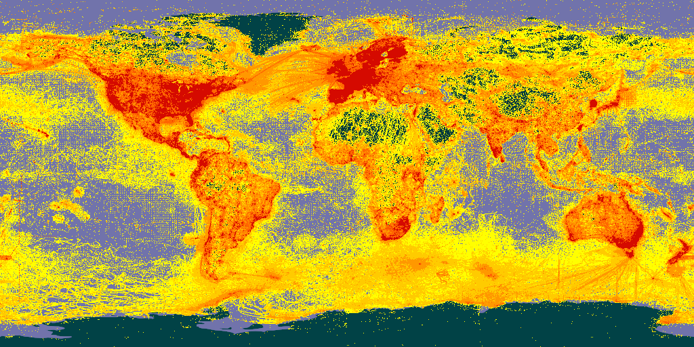
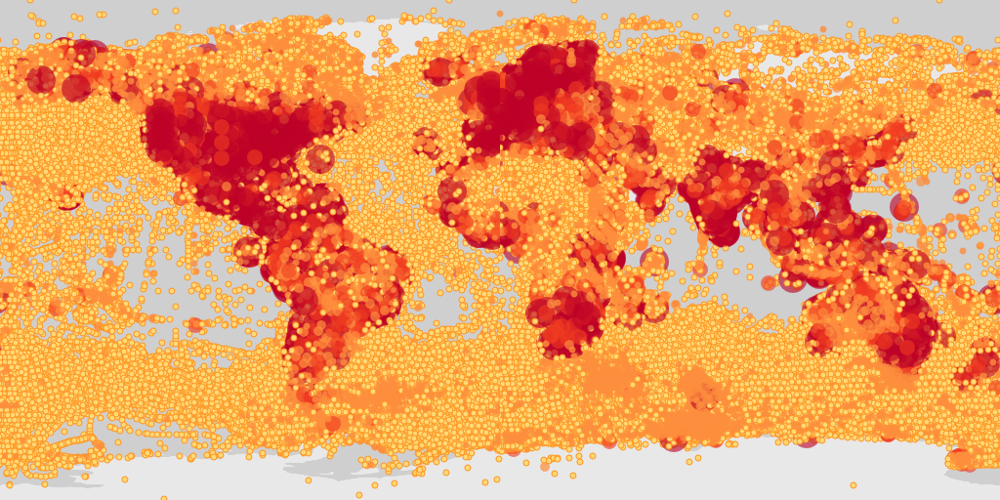
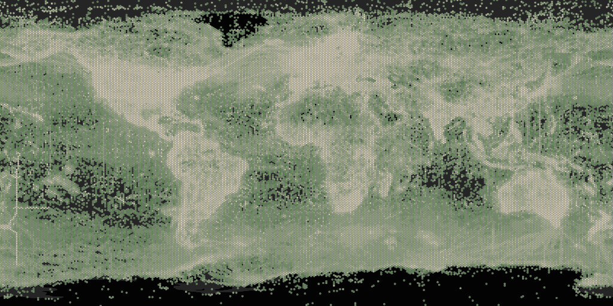
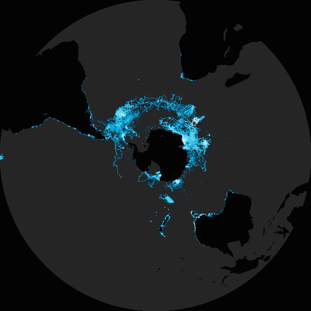
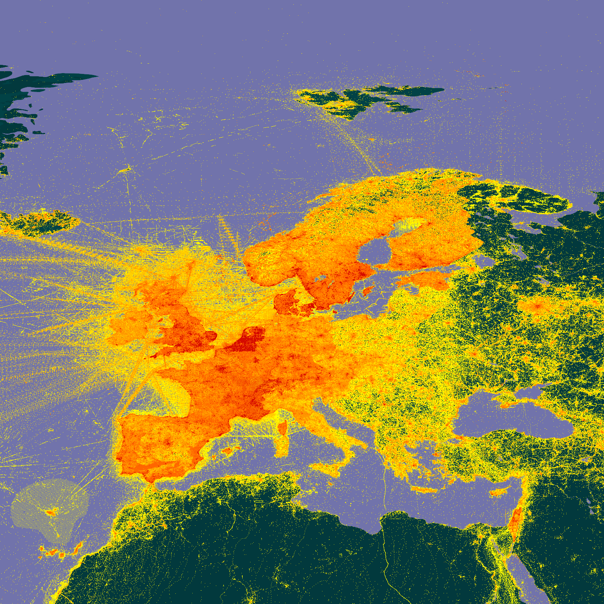
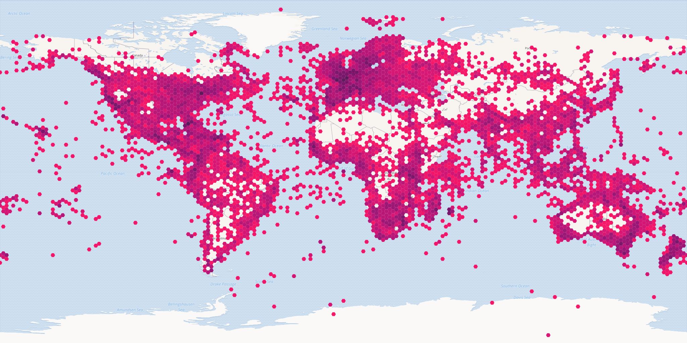
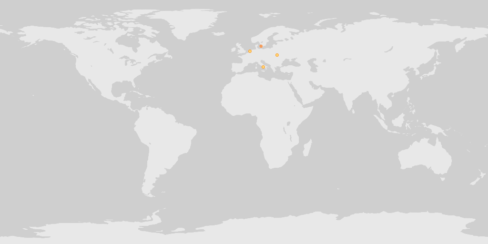
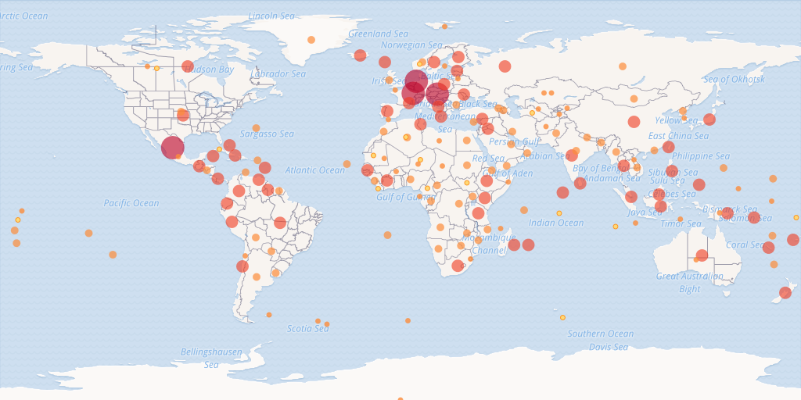
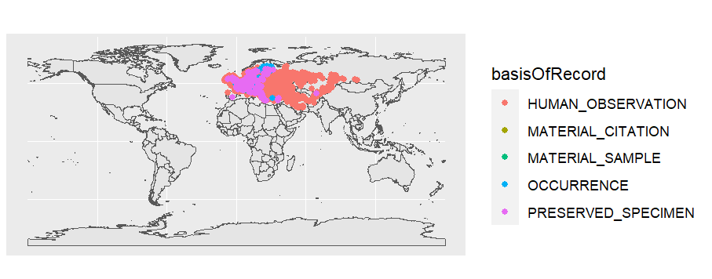

> This article is an adapted version of the rgbif article found [here]( https://docs.ropensci.org/rgbif/articles/creating_maps_from_occurrences.html).

It is often useful to create a map from GBIF mediated occurrences. While it is always possible to take a screenshot of map on [gbif.org](https://www.gbif.org/occurrence/map?occurrence_status=present), sometimes a publication quality map is needed. 

<!--more-->

Additionally, large downloads of millions of lat-lon points can be difficult to plot using `ggplot2` or base R graphics. In these cases, using the [GBIF maps API](https://www.gbif.org/developer/maps) with `rgbif::map_fetch()` can be a good option. 

## Using rgbif::map_fetch()

[rgbif](https://docs.ropensci.org/rgbif/index.html) has a function called `map_fetch()`, which interfaces directly with the GBIF [maps API](https://www.gbif.org/developer/maps). Running `map_fetch()` will return the default GBIF pixel map of all GBIF mediated occurrences. 


```R
library(rgbif)
map_fetch()
```



It is possible to make static maps that look like default [occurrence search](https://www.gbif.org/occurrence/map?taxon_key=212) maps. See the maps api page for [available styles](https://tile.gbif.org/ui/). 

```R 
map_fetch(taxonKey=212,style="scaled.circles",base_sytle="gbif-light")
```




For "poly" styles you can set the `hexPerTile` parameter, so that the binned occurrence data is essentially shown at a higher resolution. A tile is an individual `png` image that is fetch from the API in order to make a map. The default settings of `map_fetch()` will fetch two images (hemispheres), so the image below has 400 hexagons across the width of map. 

```R 
map_fetch(hexPerTile=200,style="green.poly",base_style="gbif-dark",bin="hex")
```



There is the option to plot with polar or arctic projections. For example, penguin records. 

```R 
map_fetch(srs='EPSG:3031',taxonKey=7190978,style='glacier.point', base_style="gbif-dark")
```



`map_fetch()` allows for views other than just the global map, by zooming in and selecting only certain map tiles with `z`, `x`, `y`. 

Selecting tiles can be tricky to get right, but with a little trial-and-error, you can usually get close to the map you want to have. One trick for getting the right tiles, is to look at this [demo page](https://api.gbif.org/v2/map/demo13.html#map=3/0/0/0), where the `z,x,y` values are printed on the center of each tile. 

For example, you can see what the tile values for a zoomed in map of Australia would be [here](https://api.gbif.org/v2/map/demo13.html#map=5/134.01/-21.64/0).

```R 
map_fetch(z=3,x=13:14,y=4:5)
```


Be aware that selecting many tiles will create a large image, and might crash your R session. You can control the resolution of your final image with `format`, with  `format="@4x.png"` being the highest possible value. 

Below are some areas to give you an idea of how `z`,`x`,`y` it are working. 

```R 
# Europe
map_fetch(z=3,x=7:9,y=0:2)
```


```R
# Africa
map_fetch(z=3,x=7:10,y=2:5)
# Hawaii
map_fetch(z=6,x=6:9,y=23:25)
# South Africa 
map_fetch(z=5,x=34:38,y=19:22)
# Ukraine 
map_fetch(z=6,x=70:78,y=13:16)
# Iceland
map_fetch(z=6,x=55:59,y=8:9)
# Capri Is. 
map_fetch(z=12,x=4419:4420,y=1124:1125)
```


I suggest using this [interactive page](https://api.gbif.org/v2/map/demo13.html#map=3/0/0/0) for getting the tile numbers. 

Keep in mind that the the GBIF maps API wasn't designed to make high quality static maps, like it is being used for in `map_fetch()`. It was designed for interactive use on the [GBIF website](https://www.gbif.org/occurrence/map?), so the API design reflects this reality. 

When making maps, the **named paramters**, `taxonKey`, `datasetKey`, `country`, `publishingOrg`,  `publishingCountry`, `year`, and `basisOfRecord` are going to be the easiest to use.  However, It is possible to make "any" map (any [search filter](https://www.gbif.org/occurrence/map?recorded_by=John%20Waller&advanced=1&occurrence_status=present)) using `source=adhoc`. 

```R 
# all occurrences with iucn status critically endangered 
map_fetch(z=1,x=0:3,y=0:1,source="adhoc",iucn_red_list_category="CR",
          style="iNaturalist.poly",base_style='osm-bright',bin="hex")
```



`map_fetch()` can also tell when you have used a parameter that is no a default parameter and automatically switch to `source="adhoc"` for you. I have found that point style don't work well with `source="adhoc"`, so `map_fetch()` will give a warning if you try to use a point style with `source="adhoc"`. 

Here are some examples of maps with different parameters and styles. 

`adhoc` is needed here  because `recordedBy` isn't one of the named paramters. `map_fetch()` automatically detects this and switches source to "adhoc". 

```R 
map_fetch(recordedBy="John Waller")
```



Occurrences in the OBIS network. Note that `squareSize` only works with `bin="square"`.

```R
map_fetch(z=1,source="adhoc",style="green.poly",squareSize=64,bin="square",network_key="2b7c7b4f-4d4f-40d3-94de-c28b6fa054a6")
```

Map of Texas using the `gadm` filter.

```R 
map_fetch(z=4,x=6:7,y=4:5,gadm_gid="USA.44_1",style="blue.marker") 
```
`map_fetch()` is generally forgiving and will give you back at least some map with warnings or blank images when the parameters don't work.

```R 
map_fetch(x=1:5) # no tiles exist past 2, so blank images are returned
```

All specimen bird records from the year 2000.

```R 
map_fetch(taxonKey=212, basisOfRecord="PRESERVED_SPECIMEN", year=2000,style="classic-noborder.poly")  
```

Map of all country centroid locations.

```R 
map_fetch(distanceFromCentroidInMeters=0,base_style="osm-bright")
```



In general, adhoc maps are harder to make look nice, but usually picking a non-point style and tuning `hexPerTile` and perhaps also `squareSize`, will make a nice map.

```R 
map_fetch(source="adhoc",project_id="BID-AF2015-0134-REG",style="green2.poly",hexPerTile=50)
```

A tip for getting the un-named adhoc parameters is to pull them from the occurrence search URL after looking them up via the [web interface](https://www.gbif.org/occurrence/map?advanced=1&project_id=BID-AF2015-0134-REG).

```R
# https://www.gbif.org/occurrence/map?advanced=1&project_id=BID-AF2015-0134-REG
map_fetch(source="adhoc",project_id="BID-AF2015-0134-REG") 
```

You can read more about `map_fetch()` on the rgbif documentation website [here](https://docs.ropensci.org/rgbif/reference/map_fetch.html).


## Using ggplot2::geom_sf()

The GBIF maps API is powerful and useful, but can be frustrating if your plot needs a some custom styling or legends. If you don't have a **large** dataset, then using `ggplot::geom_sf()` can be a good option.  

```R 
library(rgbif)
library(ggplot2)
library(sf)
library(rnaturalearth)

# occ_download(pred_default(),pred(taxonKey,"1427067"),format="SIMPLE_CSV")

worldmap <- ne_countries(scale = 'medium', type = 'map_units',returnclass = 'sf')

# a download I made of all Calopteryx splendens occurrences 
d <- occ_download_get('0001707-230810091245214') %>%
  occ_download_import()

d_sf <- sf::st_as_sf(d, coords = c("decimalLongitude", "decimalLatitude"),
        crs = "+proj=longlat +datum=WGS84")

# color occurrences by basisOfRecord
ggplot() + 
  geom_sf(data = worldmap) + 
  geom_sf(data = d_sf,aes(color=basisOfRecord))
   
```



See [ggplot2](https://ggplot2.tidyverse.org/reference/ggsf.html) docs for more. 

## Using leaflet

Since the GBIF maps API was designed to work as an interactive map, it can be used with [leaflet](https://rstudio.github.io/leaflet/). 

```R 
library(leaflet)

leaflet() %>% 
  addTiles() %>%
  addTiles(urlTemplate='https://api.gbif.org/v2/map/occurrence/density/{z}/{x}/{y}@1x.png?style=scaled.circles&taxonKey=5219404') 

```

See [leaflet](https://ggplot2.tidyverse.org/reference/ggsf.html) docs for more. 


