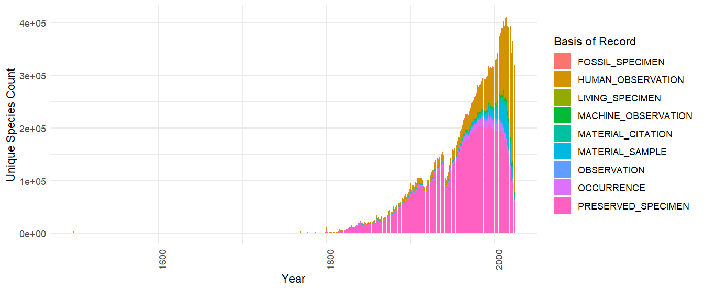

> GBIF has an experimental feature that allows users to download data from the GBIF database in SQL format. Contact [helpdesk\@gbif.org](mailto:helpdesk@gbif.org) to request access. <https://techdocs.gbif.org/en/data-use/api-sql-downloads>

> If your download can be formulated using the traditional predicate downloads, it is usually going to be faster to use regular downloads.

The experimental Occurrence SQL Download API allows users to query GBIF occurrences using SQL. In contrast to the [Predicate Download API](https://techdocs.gbif.org/en/data-use/api-sql-downloads), the SQL API allows selection of the columns of interest and generation of summary views of GBIF data.

SQL downloads, like [predicate downloads](https://techdocs.gbif.org/en/data-use/api-downloads), require you to have a GBIF [user account](https://www.gbif.org/user/profile).

<!--more-->

## SQL Download Workflow

The first step is to prepare your query. There is only one table available for querying, the **occurrence** table. You can check if the query is ok using [query validation](https://techdocs.gbif.org/en/data-use/api-sql-downloads#sql-validation). You can also check what fields are available in the `occurrence` table using this endpoint `https://api.gbif.org/v1/occurrence/download/describe/sql`. There are +400 columns available.

``` sql
SELECT datasetKey, countryCode, COUNT(*) FROM occurrence WHERE continent = 'EUROPE' GROUP BY datasetKey, countryCode
```

This query should be included in a json POST request, and saved to a file named, for example, `query.json`.

``` json
{
  "sendNotification": true,
  "notificationAddresses": [
    "userEmail@example.org" 
  ],
  "format": "SQL_TSV_ZIP", 
  "sql": "SELECT datasetKey, countryCode, COUNT(*) FROM occurrence WHERE continent = 'EUROPE' GROUP BY datasetKey, countryCode" 
}
```

The request should then be sent as a POST request to the endpoint `https://api.gbif.org/v2/occurrence/download/request`

``` shell
curl --include --user YOUR_GBIF_USERNAME:YOUR_PASSWORD --header "Content-Type: application/json" --data @query.json https://api.gbif.org/v1/occurrence/download/request
```

The download will appear in your [GBIF user account](https://www.gbif.org/user/download).

## SQL examples - Multi-dimension Counts

One common query that is difficult to do with the traditional downloads interface is to get a occurrence counts of species by multiple dimensions. This query gets a table with **countries and species with the most occurrences published to GBIF** without having to download a large table and do the aggregation locally.

``` sql
SELECT publishingcountry, specieskey, COUNT(*) as occurrence_count
FROM occurrence
WHERE publishingcountry IS NOT NULL AND specieskey IS NOT NULL
GROUP BY publishingcountry, specieskey
ORDER BY occurrence_count DESC;
```

| publishingcountry | specieskey | occurrence_count |
|:------------------|-----------:|-----------------:|
| US                |    2495347 |         23467566 |
| US                |    2490384 |         21442333 |
| US                |    9510564 |         20975419 |
| US                |    2482507 |         20396610 |
| US                |    2482593 |         17855746 |
| US                |    9761484 |         17814101 |

## SQL examples - Time Series

Another interesting query would be to get a times series of number of species "collected/observed" over years, grouped by basis of record.

``` sql
SELECT
    basisOfRecord,
    "year",
    COUNT(DISTINCT speciesKey) AS unique_species_count
FROM
    occurrence
GROUP BY
    basisOfRecord,
    "year";
```

Note that `"year"` needs to be double quoted as it is a reserve word. This is true also for other reserve words like `"month"`, `"day"` etc. This graphic shows the rising influence of **Human Observations** in GBIF mediated occurrences data.



## SQL examples - Grid Functions

Making a global map of unique species counts per grid cell is a common task, but because it requires a spatial join with the chosen spatial grid, it can be difficult to do without working with a large amount occurrence records.

For this reason GBIF's SQL downloads provide support for a few pre-defined [grid functions](https://techdocs.gbif.org/en/data-use/api-sql-download-functions). These functions will return a **grid cell code** for each occurrence, which can then be used to aggregate or plot the data.

-   **EEA Reference Grid**, GBIF_EEARGCode
-   **Military Grid Reference System**, GBIF_MGRSCode
-   **Quarter degree cell code**, GBIF_QDGCCode
-   **ISEA3H Grid cell code**, GBIF_ISEA3HCode

Below is example of working with the **Military Grid Reference System** (MGRS) grid. This example will return a table with unique species counts per grid cell and an attached grid code, which in this case is `mgrs`.

``` sql
SELECT 
  GBIF_MGRSCode(
    100000, 
    decimalLatitude,
    decimalLongitude,
    0 
  ) AS mgrs,
  COUNT(DISTINCT speciesKey) AS unique_species_count
FROM
  occurrence
GROUP BY
  mgrs
```

The grid code can then be used to join with a shapefile or geojson file that contains the grid cells.

This image uses shapefiles from [this repository](https://github.com/klaukh/MGRS).

The sql grid functions were originally designed to be used with creating [species occurrence cubes](https://b-cubed.eu/data-and-evidence). Therefore a randomization parameter was supported `COALESCE(coordinateUncertaintyInMeters, 0)`. This should be set to 0 if you want to use the grid functions with **no randomization**.

``` sql
SELECT 
  GBIF_EEARGCode(
    10000, 
    decimalLatitude,
    decimalLongitude,
    0
  ) AS cellcode,
  COUNT(DISTINCT speciesKey) AS unique_species_count
FROM
  occurrence
GROUP BY
  cellcode
```

The EEA reference grid example can be found here.

<https://sdi.eea.europa.eu/data/93315b78-089d-43a5-ac76-b3df627b2e4cf>

.jpg)

## Supported SQL

Only `SELECT` queries are supported, and only queries against a single table named `occurrence`. `JOIN` queries and sub-queries are not allowed. Selecting `*` is also not allowed. One must explicitly select the columns needed.

`GROUP BY` queries are supported, as are basic SQL window functions (`OVER` and `PARTITION BY`). `ORDER BY` is supported.

Most common SQL operators and functions are supported, such as `AND`, `OR`, `NOT`, `IS NULL`, `RAND()`, `ROUND(…)`, `LOWER(…)`, etc. Case is ignored by the GBIF SQL parser, and all column names are returned as lowercase.

## When not to use

If you need only commonly used occurrence columns and simple filters, most of the time you can use the regular [download interface](https://www.gbif.org/occurrence/search) instead of the SQL interface, and it will be faster.

Keep in mind that if you only need species counts for one dimension, then [facet queries](https://api.gbif.org/v1/occurrence/search?facet=specieskey) are usually going to be a much faster option (although you won't receive a DOI). Some examples below:

```         
http://api.gbif.org/v1/occurrence/search?facet=speciesKey&country=US
http://api.gbif.org/v1/occurrence/search?facet=speciesKey&country=US&year=1800,1900
http://api.gbif.org/v1/occurrence/search?facet=speciesKey&country=US&year=1800,1900&basisOfRecord=HUMAN_OBSERVATION
http://api.gbif.org/v1/occurrence/search?facet=country&facetLimit=200
```

## rgbif example

SQL downloads is also supported by [rgbif](https://docs.ropensci.org/rgbif/index.html) by using `occ_download_sql()`. Please see this [article](https://docs.ropensci.org/rgbif/articles/gbif_sql_downloads.html) for the easiest way get started with SQL downloads. Remember to set up your [GBIF credentials](https://docs.ropensci.org/rgbif/articles/gbif_credentials.html).

``` r
library(rgbif)

occ_download_sql("SELECT datasetKey, countryCode, COUNT(*) FROM occurrence WHERE continent = 'EUROPE' GROUP BY datasetKey, countryCode")
```

## Further Reading

<https://techdocs.gbif.org/en/data-use/api-sql-downloads>
