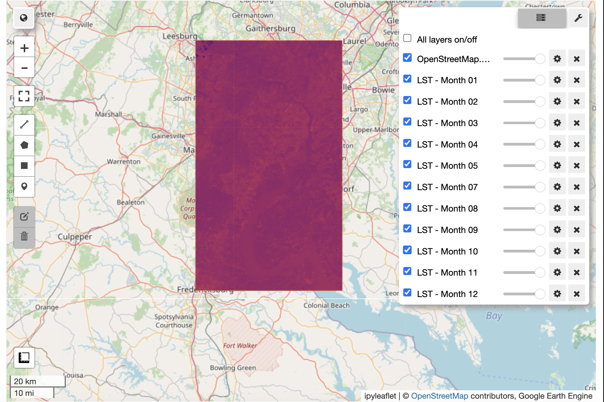
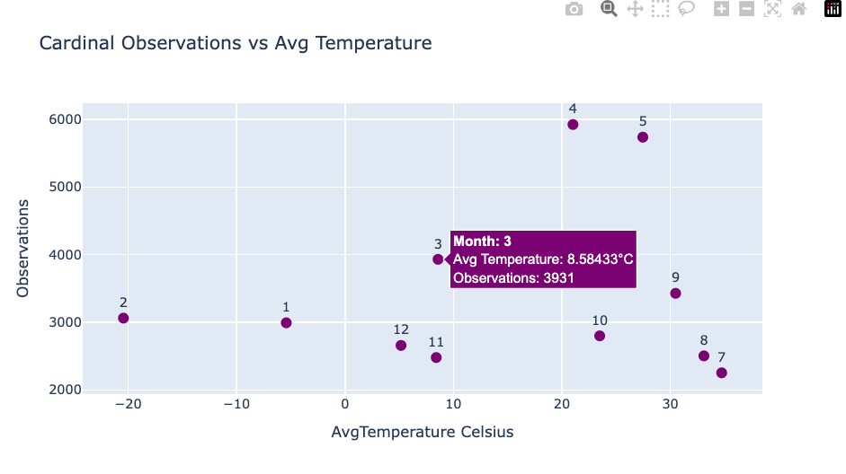

<iframe src="https://www.loom.com/embed/ac617862ef8d4e978684c561d93e9950?sid=409893b6-ae8b-43dc-bcf4-ee6425507788"
        frameborder="0"
        webkitallowfullscreen
        mozallowfullscreen
        allowfullscreen>

</iframe>

In this tutorial, we explored how to integrate remote sensing data with biodiversity observations to analyze the relationships between environmental factors and species occurrences. Specifically, we focused on analyzing **Land Surface Temperature (LST)** over time and its relationship to observations of the Northern Cardinal (Cardinalis cardinalis), a well-known songbird species.

<!--more-->

### Objectives

1.  **Land Surface Temperature (LST) Analysis**

We used remote sensing data from the Landsat 8 satellite to compute monthly averages of LST across a defined region of interest (ROI). The tutorial demonstrated how to:

-   Query LST data using Google Earth Engine (GEE) for specific months in 2019.
-   Aggregate LST data to calculate monthly average temperatures.

1.  **Species Observation Time Series** Using occurrence data for Cardinalis cardinalis from the Global Biodiversity Information Facility (GBIF), the tutorial guided users through:

-   Fetching observation records using spatial and temporal filters (e.g., only human observations from 2019).
-   Preprocessing these records to extract relevant metadata, such as the month of observation and geographical coordinates.

1.  **Combining Datasets for Time-Series Analysis** The LST data and *Cardinalis cardinalis* observation records were combined into a single dataset to enable time-series analysis. Key steps included:

-   Summarizing monthly observation counts.
-   Merging these counts with monthly average temperatures for the same region.

1.  **Data Visualization** The final step was visualizing the relationships between temperature and bird observations through:

-   **Line plots** showing temporal trends in temperature and observation counts across the year.
-   **Scatter plots** highlighting correlations between average monthly temperature and the number of Cardinalis cardinalis observations.

### Insights and Applications

This tutorial demonstrates a practical workflow for integrating remote sensing and biodiversity data, offering a framework for analyzing species-environment interactions over time. It highlights how:

-   LST data can serve as a proxy for environmental conditions affecting species behavior and distribution.
-   Temporal trends in species observations can reveal seasonal or climatic influences.
-   Integrating geospatial and temporal datasets provides a powerful approach to ecological research.

### Tools and Libraries Used

-   **Google Earth Engine (GEE)**: For querying and processing LST imagery.
-   **GBIF API**: To fetch species occurrence data filtered by time, location, and observation method.

**Python Libraries**:

-   `pandas` and `geopandas` for data manipulation.
-   `matplotlib` and `plotly` for visualization.
-   `shapely` for spatial operations.

> Feel to reach out to [krle4401\@colorado.edu](mailto:krle4401@colorado.edu) with questions and make the subject something like "GBIF LST Tutorial Questions"

**Step One**: Import Libraries and Initialize Google Earth Engine

``` python
# Required Libraries
import ee
import geemap
import geemap.colormaps as cm
from pygbif import occurrences as gbif_occ
from shapely.geometry import Point
import geopandas as gpd
import matplotlib.pyplot as plt
import pandas as pd
import ipywidgets as widgets  # Import ipywidgets

# Initialize Earth Engine
ee.Authenticate()
ee.Initialize(project="ee-krle4401")
```

**Step Two**: Set a ROI (Region of Interest), Fetch Landsat Imagery with the Thermal Band, and Inspect Cloud Coverage

``` python
# ROI: DC/Virginia area
roi = ee.Geometry.Polygon(
    [[[-77.5, 38.3], [-77.5, 39.1], [-76.9, 39.1], [-76.9, 38.3], [-77.5, 38.3]]]
)

# Function to fetch monthly LST and count images
def get_landsat_lst(month):
    start_date = f"2019-{month:02d}-01"
    end_date = f"2019-{month:02d}-{31 if month in [1, 3, 5, 7, 8, 10, 12] else (30 if month != 2 else 28)}"

    collection = (
        ee.ImageCollection("LANDSAT/LC08/C02/T1_L2")
        .filterBounds(roi)
        .filterDate(start_date, end_date)
        .filter(ee.Filter.lt("CLOUD_COVER", 40))
    )

    image_count = collection.size().getInfo()
    if image_count == 0:
        print(f"No images available for {start_date} to {end_date}")
        return None, image_count

    print(f"{image_count} images available for {start_date} to {end_date}")
    lst = collection.map(lambda img: img.select("ST_B10").multiply(0.00341802).add(149).subtract(273.15))
    return lst.mean().clip(roi), image_count

# Fetch LST images and log image counts
lst_monthly = {}
image_counts = {}

for month in range(1, 13):
    lst, count = get_landsat_lst(month)
    if lst:
        lst_monthly[month] = lst
    image_counts[month] = count

# Visualize the image counts as a bar chart
months = list(image_counts.keys())
counts = list(image_counts.values())

plt.bar(months, counts, color="skyblue")
plt.xlabel("Month")
plt.ylabel("Number of Images")
plt.title("Landsat Images per Month (2019)")
plt.xticks(months)
plt.show()
```

.png)

If you wanted to pull everything, use the below, but make sure you have a lot of time!

**Step Three**: Let's look at records over the year of *Cardinalis cardinalis*

``` python
from pygbif import occurrences as gbif_occ
import geopandas as gpd
from shapely.geometry import Point, Polygon
import pandas as pd

# Define bounding box coordinates for ROI
bounding_box_coords = [
    (-77.5, 38.3),  # Bottom-left
    (-76.9, 38.3),  # Bottom-right
    (-76.9, 39.1),  # Top-right
    (-77.5, 39.1),  # Top-left
    (-77.5, 38.3),  # Close the polygon
]

# Create a polygon from the bounding box
bounding_polygon = Polygon(bounding_box_coords)

# Iterate through each month
for month in range(1, 2):
    # Define a unique output CSV file for each month
    output_csv = f"cardinalis_cardinalis_2019_month_{month:02d}.csv"

    # Create the CSV file with headers for this month
    pd.DataFrame(columns=["species", "kingdom", "basisOfRecord", "latitude", "longitude", "date_collected"]).to_csv(
        output_csv, index=False
    )

    print(f"Fetching data for month {month:02d}...")

    # Pagination variables
    limit = 300
    offset = 0

    while True:
        # Query GBIF API for Cardinalis cardinalis for the specific month
        response = gbif_occ.search(
            geometry=bounding_polygon.wkt,
            hasCoordinate=True,
            basisOfRecord="HUMAN_OBSERVATION",
            year=2019,
            month=month,
            scientificName="Cardinalis cardinalis",  # Filter for Cardinalis cardinalis
            limit=limit,
            offset=offset
        )
        

        # Extract results
        results = response.get("results", [])
        if not results:
            break

        # Process records
        batch_records = []
        for occ in results:
            try:
                # Extract required fields
                latitude = float(occ["decimalLatitude"])
                longitude = float(occ["decimalLongitude"])
                event_date = occ.get("eventDate", "Unknown Date")
                species = occ.get("species", "Unknown")
                kingdom = occ.get("kingdom", "Unknown")
                basis_of_record = occ.get("basisOfRecord", "Unknown")
                
                # Check if the point is inside the bounding polygon
                point = Point(longitude, latitude)
                if bounding_polygon.contains(point):
                    batch_records.append({
                        "species": species,
                        "kingdom": kingdom,
                        "basisOfRecord": basis_of_record,
                        "latitude": latitude,
                        "longitude": longitude,
                        "date_collected": event_date,
                    })
            except (KeyError, TypeError, ValueError):
                # Skip malformed records
                continue

        # Append batch to the month's CSV
        if batch_records:
            pd.DataFrame(batch_records).to_csv(output_csv, mode="a", index=False, header=False)

        # Update offset for next batch
        offset += limit

        print(f"Fetched {len(results)} records so far for month {month:02d}, offset: {offset}")

    print(f"Data for month {month:02d} saved to {output_csv}")

print("Data fetching complete!")
```

``` python
import geemap

# Initialize geemap.Map for LST data
map_lst = geemap.Map(center=[38.7, -77.2], zoom=8)

# Add LST layers for months with data
palette = cm.palettes.inferno
for month, img in lst_monthly.items():
    print(f"Adding LST layer for month {month}")
    map_lst.addLayer(img, {"min": -20, "max": 40, "palette": palette}, f"LST - Month {month:02d}")

# Save the LST map to an HTML file
output_html_lst = "lst_data_map.html"
map_lst.save(output_html_lst)

map_lst
```



``` python
import pandas as pd
import geopandas as gpd
from shapely.geometry import Point
from glob import glob
import geemap
from dateutil import parser

# Function to safely parse dates and extract the month
def parse_date_and_get_month(date_str):
    try:
        return parser.parse(date_str).month  # Use dateutil.parser to handle mixed formats
    except (ValueError, TypeError):
        return None  # Return None for invalid dates

# Initialize geemap.Map
map_combined = geemap.Map(center=[38.7, -77.2], zoom=8)

# Add LST layers for months with data
palette = cm.palettes.inferno
for month, img in lst_monthly.items():
    print(f"Adding LST layer for month {month}")
    map_combined.addLayer(img, {"min": -20, "max": 40, "palette": palette}, f"LST - Month {month:02d}")

# Combine all 12 CSV files into a single DataFrame
csv_files = sorted(glob("cardinalis_cardinalis_2019_month_*.csv"))  # Match your CSV files
dfs = [pd.read_csv(csv_file) for csv_file in csv_files]  # Use pandas to read CSVs
combined_df = pd.concat(dfs, ignore_index=True)  # Combine all DataFrames

# Parse 'date_collected' to extract the month
combined_df["month"] = combined_df["date_collected"].apply(parse_date_and_get_month)

# Drop rows with invalid months
combined_df = combined_df.dropna(subset=["month"])

# Select the first 30 records for each month
selected_df = combined_df.groupby("month").head(30).reset_index(drop=True)

# Convert the selected DataFrame into a GeoDataFrame
selected_gdf = gpd.GeoDataFrame(
    selected_df,
    geometry=gpd.points_from_xy(selected_df["longitude"], selected_df["latitude"]),
    crs="EPSG:4326"
)

# Add the selected GeoDataFrame as a single layer on the map
map_combined.add_gdf(selected_gdf, layer_name="Selected Cardinal Observations")

# Display the map in the notebook (if using Jupyter)
map_combined
```

``` python
import pandas as pd
import geopandas as gpd
from shapely.geometry import Point
from glob import glob
import plotly.express as px

# Combine all 12 CSV files into a single DataFrame
csv_files = sorted(glob("cardinalis_cardinalis_2019_month_*.csv"))  # Match your CSV files
dfs = [pd.read_csv(csv_file) for csv_file in csv_files]
combined_df = pd.concat(dfs, ignore_index=True)

# Convert 'date_collected' to datetime with mixed format handling
combined_df["date_collected"] = pd.to_datetime(combined_df["date_collected"], errors="coerce", utc=True)

# Extract the month from valid dates
combined_df["month"] = combined_df["date_collected"].dt.month

# Drop rows with invalid dates (if necessary)
combined_df = combined_df.dropna(subset=["month"])

# Summarize GBIF Observations by Month
monthly_observations = combined_df["month"].value_counts().sort_index()

# Assuming `lst_monthly` contains precomputed LST images
# Step 2: Compute Average Temperature for Each Month
monthly_avg_temp = {}
for month, img in lst_monthly.items():
    mean_temp = img.reduceRegion(
        reducer=ee.Reducer.mean(),
        geometry=roi,
        scale=30,
        bestEffort=True
    ).getInfo()
    monthly_avg_temp[month] = mean_temp.get("ST_B10", None)

# Step 3: Combine Observations and Temperature into a DataFrame
data = pd.DataFrame({
    "Month": range(1, 13),
    "Observations": monthly_observations.reindex(range(1, 13), fill_value=0),
    "AvgTemperature Celsius": [monthly_avg_temp.get(m, None) for m in range(1, 13)],
})

# Display the combined DataFrame
print(data)

# Step 4: Scatter Plot with Hover Tooltip
fig = px.scatter(
    data,
    x="AvgTemperature Celsius",
    y="Observations",
    text="Month",
    labels={"x": "Avg Temperature (°C)", "y": "Number of Observations"},
    title="Cardinal Observations vs Avg Temperature",
    template="plotly",
)

# Add hover info to display the month
fig.update_traces(
    marker=dict(size=10, color="purple"),
    textposition="top center",
    hovertemplate="<b>Month: %{text}</b><br>Avg Temperature: %{x}°C<br>Observations: %{y}<extra></extra>"
)

fig.show()

# Save the DataFrame for further inspection
data.to_csv("observations_vs_temperature.csv", index=False)
```


