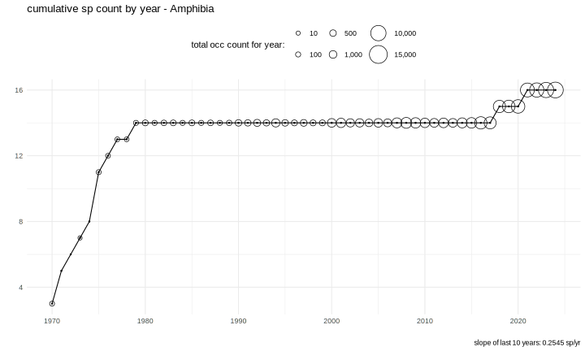
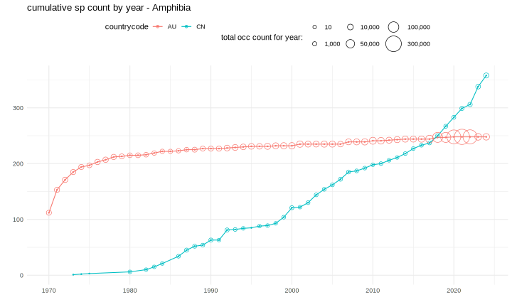
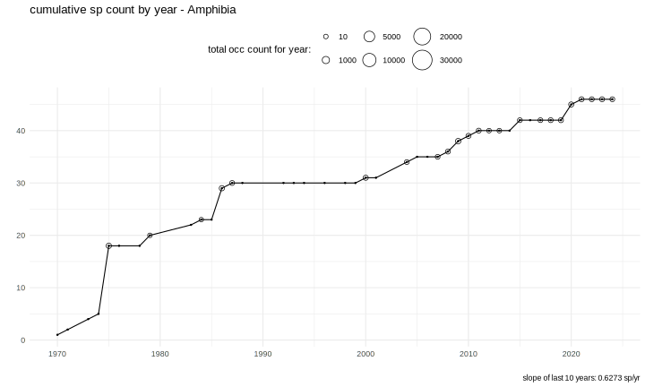
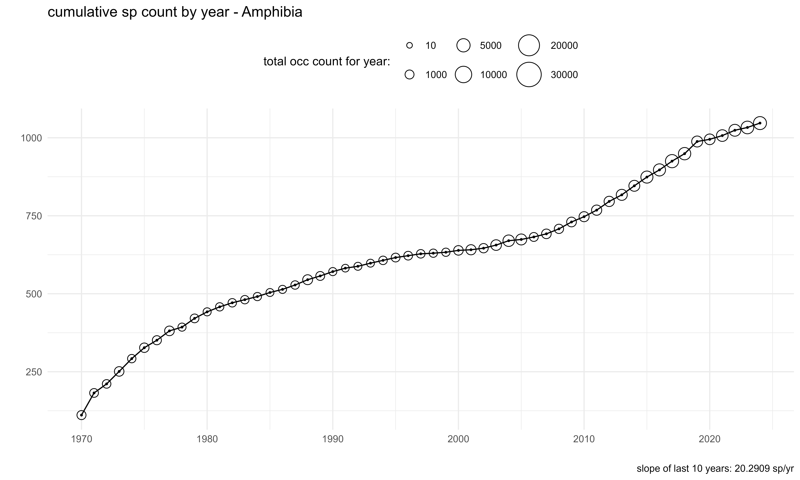
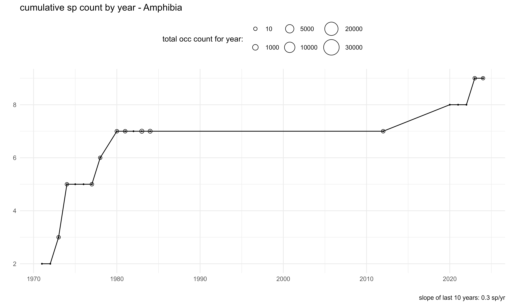
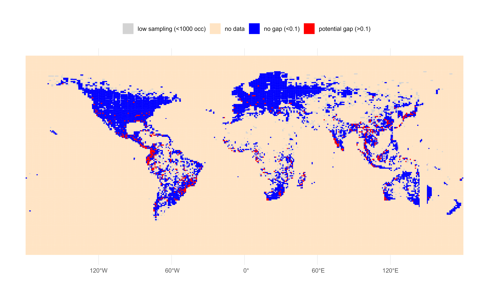

With GBIF's new SQL downloads feature, it is now possible to easily create useful custom metrics. In this post, I will create species accumulation curves for various countries/areas using [GBIF SQL downloads](https://techdocs.gbif.org/en/data-use/api-sql-downloads) and R.

> GBIF now has a new [repository](https://github.com/gbif/CommunityMetrics), **Community Metrics**, for collecting input from the GBIF community on the creation of data products derived from GBIF-mediated data that can complement those already provided through GBIF's [data analytics](https://www.gbif.org/analytics/global). The goal of this work is to produce new or further develop existing metrics, indicators and time series (trend) data products to support decision making.

A **species accumulation curve** is a plot of the total cumulative running total species in a region. These curves are useful for assessing whether more sampling is likely to yield more knowledge of a region. For example, if the curve is increasing rapidly, it is likely that the region is undersampled for the group, and there could be data gaps. Conversely, if the curve is flattening out, it is likely that the region is well sampled for the group.

<!--more-->

In this post, I will focus on the group **Amphibia**.

Below is a basic species accumulation curve for **Amphibia** in **Sweden**. Here, we see that since around 1980, the total number of species has been fairly constant, suggesting that the group is well sampled in Sweden, and therefore it is very unlikely for there to be any **data gaps**. This, of course, does not imply that continued monitoring is not useful for other reasons.

The total number of occurrences for Amphibia are also plotted as variably-sized circles. We can see that the rate of increase is less than 1 species "discovered" species per year.



Below I will show how I created this curve using GBIF SQL downloads and R.

``` r
library(rgbif)

occ_download_sql("
SELECT 
    \"year\", 
    countrycode,
    speciesKey,
    scientificname,
    COUNT(*) AS occ_count
FROM occurrence
WHERE \"year\" > 1969 AND \"year\" < 2025
  AND hasCoordinate = TRUE
  AND hasgeospatialissues = FALSE
  AND speciesKey IS NOT NULL
  AND countryCode IS NOT NULL
  AND classKey = 131
  AND basisOfRecord != 'FOSSIL_SPECIMEN'
  AND taxonrank = 'SPECIES'
GROUP BY 
speciesKey,
scientificname, 
\"year\",
countrycode;
")
```

Short explanation of the SQL above:

-   We select the columns we want from the big +400 column `occurrence` table
-   We filter the data to only include records from 1970 to 2024
-   `131` is the classKey for **Amphibia**
-   We remove fossils

This will return of a table with occurrence counts the columns `year`, `countrycode`, `speciesKey`, `scientificname`, and `occ_count`.

Note that the below query will **not** work in the current GBIF SQL downloads implementation:

``` sql
    COUNT(DISTINCT speciesKey) OVER (
        ORDER BY "year"
        ROWS BETWEEN UNBOUNDED PRECEDING AND CURRENT ROW
    ) AS cumulative_species_count
```

As we cannot do the cumulative aggregation in the GBIF SQL downloads, it is necessary to do this in R.

``` r
library(rgbif)

d <- occ_download_get("0000317-250325103851331") %>%    
    occ_download_import() |> 
    filter(countrycode == "SE") |>
    arrange(year) |>
    mutate(cumulative_species_count = cumsum(!duplicated(specieskey))) |>
    group_by(year) |>
    summarise(cumulative_species_count = max(cumulative_species_count, na.rm = TRUE),
    occ_count = sum(occ_count)) |>
    ungroup() 

p <- ggplot(dd, aes(x = year, y = cumulative_species_count)) +
    geom_line() +
    geom_point(aes(size=occ_count),shape=1) +
    geom_point(size=0.5) +
    labs(title = "cumulative sp count by year - Amphibia",
         size = "total occ count for year: ") +
    theme_minimal() +
    theme(legend.position = "top")
```

We can also compare other countries together on the same graphic to see differences species accumulation. Here we see that **Australia** (AU) has a much flatter curve than **China** (CN), which implies that continued sampling is unlikely increase our knowledge of Amphibians in Australia. Whereas in China, the curve is still increasing, suggesting that there are potential data gaps. This could be useful information for conservation funding and future mobilization efforts. Of course continued sampling, even in saturated regions, is still useful for other reasons.



**Severe undersampling** can also create a pattern that looks like a flatter curve. Here we see that **Botswana** (BW) has a somewhat flat curve, but this like is due to a low amount of sampling for Amphibians (~20 occurrences per year).



The species accumulation curve for **Brazil** (BR) is interesting, as the country has a fair amount of sampling per year (~5000 occ per yearr), but still appears to be gaining new species knowledge each year.



**Saudi Arabia** (SA) is not expected to be rich in Amphibian species and has a fairly flat curve, which probably wouldn't steepen much with increased sampling.



## Using grids

GBIF SQL downloads also allows for occurrences to be linked to grid cells. Supposed we wanted to map slopes for the last 10 years for each grid cell, attempting to reveal potential data gaps. A "high" slope for a small grid cell might be less than one species per year, but any cut off point will be somewhat arbitrary.

``` r
occ_download_sql("
SELECT 
  GBIF_MGRSCode(
    10000, 
    decimalLatitude,
    decimalLongitude,
    0
  ) AS gridcode,
    \"year\", 
    countrycode,
    speciesKey,
    scientificname,
    COUNT(*) AS occ_count
FROM occurrence
WHERE \"year\" > 1969 AND \"year\" < 2025
  AND hasCoordinate = TRUE
  AND hasgeospatialissues = FALSE
  AND speciesKey IS NOT NULL
  AND countryCode IS NOT NULL
  AND classKey = 131
  AND basisOfRecord != 'FOSSIL_SPECIMEN'
  AND taxonrank = 'SPECIES'
GROUP BY 
speciesKey,
scientificname, 
\"year\",
countrycode,
gridcode;
")
```

You can download the combined shapefile I used for this example here: <https://github.com/jhnwllr/mgrs-grid>

``` r
library(rgbif)
library(dplyr)
library(ggplot2)
library(purrr)
library(sf)

d <- occ_download_get("0005222-250325103851331") %>%    
    occ_download_import() |> 
    glimpse()

dd <- d |> 
    arrange(gridcode,year) |>
    mutate(cumulative_species_count = cumsum(!duplicated(specieskey))) |>
    filter(year >= 2015) |> # only get for the last 10 years 
    na.omit() |>
    group_by(gridcode) |>
    summarize(slope = coef(lm(cumulative_species_count ~ year))[2], 
              occ_count = max(occ_count, na.rm = TRUE)) |>
    ungroup() |>
    select(MGRS = gridcode, slope, occ_count) |>
    glimpse() 

mgrs_grid <- st_layers("mgrs-grid/")$name %>%
map(~ st_read("mgrs-grid/", layer = .) %>% st_transform(4326)) %>%
dplyr::bind_rows() %>% 
left_join(dd, by = "MGRS") |>
  mutate(
    slope_category = case_when(
      slope <= 0.1 ~ "no gap (<0.1)",
      slope > 0.1 ~ "potential gap (>0.1)",
      occ_count <= 1000 ~ "low sampling (<1000 occ)",
      TRUE ~ "no data" 
    )
  )


p <- ggplot(mgrs_grid) +
geom_sf(aes(fill = slope_category), color = NA) +
  scale_fill_manual(
    values = c("no gap (<0.1)" = "blue", 
    "potential gap (>0.1)" = "red", 
    "low sampling (<1000 occ)" = "lightgrey",
    "no data" = "bisque"),  
    na.value = "white"  
  ) +
theme_minimal() + 
theme(
  legend.position = "top",
  legend.title = element_blank(),
  plot.title = element_text(hjust = 0.5)
)
```



Here we can see that a few areas with likely data gaps for Amphibians. By only including areas where there have been more than 1000 occurrence records for Amphibians in the last 10 years, I have somewhat accounted for flat curves due to low sampling effort. Of course one should not interpret every gridcell completely literally because data quality issues, such as a few mis-indentifications, could create a high slope artificially. However, clusters of gridcells with potential gaps are likely to be more indicative of reality.

## 
