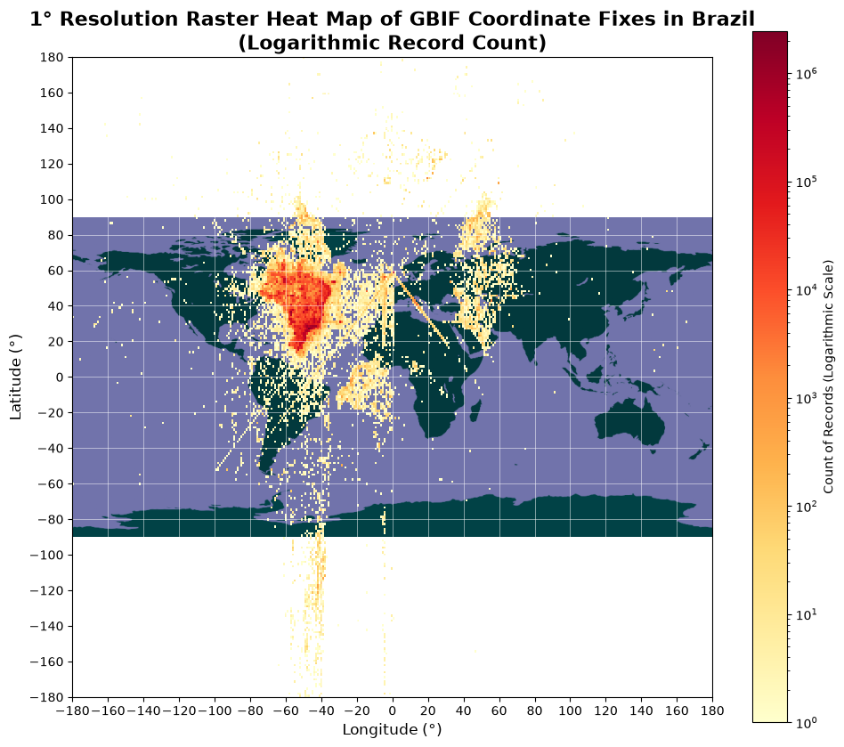
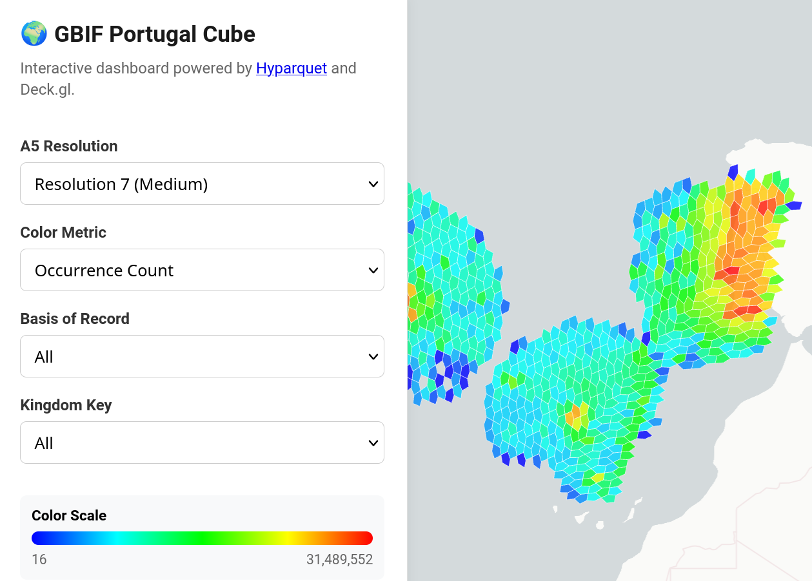

In April 2021, GBIF began exporting [monthly data snapshots](https://www.gbif.org/occurrence-snapshots) to the Microsoft Planetary Computer (Azure), as an Amazon AWS Open Dataset and as a Google Public Dataset.  These exports contain similar data columns as a [“Simple” format download](https://techdocs.gbif.org/en/data-use/download-formats#simple), but use the Parquet format which is better suited for use with cloud or big data tools.

Since then, the Parquet format has gained support for geographic data types and tooling has improved to support partitioning, better compression and indexing features.  These allow for faster querying, potentially directly within websites without needing web services.  Tools such as ArcGIS and QGIS are also introducing support for working with data in Parquet format, and GBIF users have requested additional fields be added to the download format and cloud snapshots.

We are therefore seeking feedback for an expanded Parquet download format containing similar data columns to a Darwin Core Archive format download.  This will initially be made available on the three cloud platforms.

## Quick example

[DuckDB](https://duckdb.org) is a command-line database tool with built-in support for querying Parquet files on cloud data systems.

[Install DuckDB](https://duckdb.org/install/), run it, and search for spider occurrences with CC0 licenced media – a query that is not possible through the GBIF API or website.

```
INSTALL httpfs;
LOAD httpfs;

SELECT
  occ.gbifid,
  occ.datasetKey,
  occ.scientificName,
  'https://api.gbif.org/v1/image/cache/occurrence/' || occ.gbifid || '/media/' || MD5(mul.identifier) AS apiUrl
FROM read_parquet('s3://gbif-public-data/development/2026-08-01-DWCA/occurrence/p_taxon_a5/*/*/*', hive_partitioning = true, hive_types = {'a5_r2': UBIGINT}) occ
LEFT JOIN read_parquet('s3://gbif-public-data/development/2026-08-01-DWCA/multimedia/p_gbifid1000000/*/*', hive_partitioning = true, hive_types = {'gbifid_div1000000': UBIGINT}) mul ON (occ.gbifid//1000000) = mul.gbifid_div1000000 AND occ.gbifid = mul.gbifid
WHERE taxonPartition = 'Animalia'
  AND occ.taxonKey = 'CCQKT'
  AND mul.license LIKE 'http://creativecommons.org/publicdomain/zero%'
  LIMIT 1000;
```

## Overview of changes

The proposed Parquet format has three significant changes:

1. Coordinate column and precalculated grids

A column `coordinates` contains the interpreted coordinates (Darwin Core `decimalLatitude` and `decimalLongitude`).  Rows are ordered using `ST_Hilbert(coordinates, …)`.

There are also additional columns for [A5](https://a5geo.org) or [H3](https://h3geo.org) discrete global grids (DGGSs).

This allows geographic functions such as `ST_Within` (see below) to be used directly, as well as faster generation of maps and some general statistical analysis.

2. Taxonomy and grid partitions

The tables use Hive partitioning to split the data into very roughly equal chunks.  These are at different ranks, since some bird families contain more occurrences than other entire kingdoms.

```
┌─────────────────┬──────────────┐
│ taxonpartition  │     count    │
├─────────────────┼──────────────┤
│ Cardinalidae    │     45628746 │
│ Hirundinidae    │     50158466 │
│ Tyrannidae      │     57808529 │
│ Icteridae       │     70873667 │
│ Paridae         │     79916224 │
│ Turdidae        │     82524897 │
│ Fringillidae    │    100596559 │
│ Passerellidae   │    104560140 │
│ Accipitriformes │    115363647 │
│ Corvidae        │    119908434 │
│ Chordata        │    185949778 │
│ Charadriiformes │    201986217 │
│ Anseriformes    │    206440050 │
│ NULL            │    246739000 │
│ Animalia        │    483652533 │
│ Aves            │    541973016 │
│ Passeriformes   │    576966491 │
│ Plantae         │    638966421 │
└─────────────────┴──────────────┘
```

Specifying the appropriate partition will save a lot of time when querying, e.g. to query for foxes ([taxonKey 87C5](https://www.gbif.org/taxon/87C5)) use `taxonPartition = 'Chordata' AND genusKey = '87C5'`.

There is also a partition on either A5 (resolution 2) or H3 (resolution 0) cells.  For geographic queries, calculate the complete coverage in cells for your query and add this to the WHERE clause. For example, to query for occurrences in the polygon `'POLYGON ((-9.9 49.3, 2.8 49.3, 2.8 59.6, -9.9 59.6, -9.9 49.3))'`:

```
SELECT
  COUNT(*) AS count,
  countryCode
FROM read_parquet('s3://gbif-public-data/development/2026-08-01-DWCA/occurrence/p_taxon_a5/*/*/*', hive_partitioning = true, hive_types = {'a5_r2': UBIGINT})
WHERE a5_r2 IN a5_geometry_to_cells('POLYGON ((-9.9 49.3, 2.8 49.3, 2.8 59.6, -9.9 59.6, -9.9 49.3))'::GEOMETRY, 2)
AND ST_Within(coordinates, 'POLYGON ((-9.9 49.3, 2.8 49.3, 2.8 59.6, -9.9 59.6, -9.9 49.3))'::GEOMETRY)
GROUP BY countryCode
ORDER BY count DESC
LIMIT 5;
```

This should give a similar result to [the same polygon on www.GBIF.org](https://www.gbif.org/occurrence/search?geometry=POLYGON%28%28-9.9+49.3%2C2.8+49.3%2C2.8+59.6%2C-9.9+59.6%2C-9.9+49.3%29%29&view=dashboard&layout=country.v-TABLE) (counts have increased since the snapshot was taken).

3. Inclusion of Verbatim and Multimedia tables

These are stored as separate tables, partitioned into `gbifid // 1000000` chunks (the record with `gbifid = 12345678` will be stored in the partition with `gbifid_div1000000 = 12000000`).  Access them within DuckDB like this:

```
SELECT occ.*, ver.*, mul.*
  FROM read_parquet('s3://gbif-public-data/development/2026-08-01-DWCA/occurrence/p_taxon_a5/*/*/*', hive_partitioning = true, hive_types = {'a5_r2': UBIGINT}) occ
  INNER JOIN read_parquet('s3://gbif-public-data/development/2026-08-01-DWCA/verbatim/p_gbifid1000000/*/*', hive_partitioning = true, hive_types = {'gbifid_div1000000': UBIGINT}) ver ON (occ.gbifid//1000000) = ver.gbifid_div1000000 AND occ.gbifid = ver.gbifid
  LEFT JOIN read_parquet('s3://gbif-public-data/development/2026-08-01-DWCA/multimedia/p_gbifid1000000/*/*', hive_partitioning = true, hive_types = {'gbifid_div1000000': UBIGINT}) mul ON (occ.gbifid//1000000) = mul.gbifid_div1000000 AND occ.gbifid = mul.gbifid
  WHERE taxonPartition = 'Chordata' AND genusKey = '87C5'
  LIMIT 10;
```

4. Improved compression

Zstd compression is used.  The Parquet files are significantly smaller than with the previous Snappy compression.  Tools supporting Parquet should handle this change automatically.

## Additional examples

1. Using a Python notebook to query and analyse some data

This Python notebook queries for the verbatim (published) coordinates of records in Brazil and displays them on a map.  Note the mirror image copies of the country with negated or transposed coordinates.

<details>
    <summary>Expand to show setup</summary>

```python
import duckdb
import pandas as pd
import numpy as np
import matplotlib.pyplot as plt

# Initialize DuckDB and load HTTPFS extension for S3 access
con = duckdb.connect()
con.execute("INSTALL httpfs;")
con.execute("LOAD httpfs;")

# Configure S3 for public bucket access (GBIF public data [development])
con.execute("SET s3_region='us-east-1';")
con.execute("SET s3_url_style='path';")

print("DuckDB initialized.")
```

    DuckDB initialized.

</details>

```python
query_heatmap = """
SELECT
  CASE WHEN array_contains(issue, 'PRESUMED_NEGATED_LONGITUDE') THEN FLOOR(-decimalLongitude)
       WHEN array_contains(issue, 'PRESUMED_SWAPPED_COORDINATE') THEN FLOOR(decimalLatitude)
       ELSE FLOOR(decimalLongitude)
  END AS lon_bin,
  CASE WHEN array_contains(issue, 'PRESUMED_NEGATED_LATITUDE') THEN FLOOR(-decimalLatitude)
       WHEN array_contains(issue, 'PRESUMED_SWAPPED_COORDINATE') THEN FLOOR(decimalLongitude)
       ELSE FLOOR(decimalLatitude)
  END AS lat_bin,
  COUNT(*) AS record_count
FROM read_parquet('s3://gbif-public-data/development/2026-08-01-DWCA/occurrence/p_taxon_h3/*/*/*') occ
WHERE occ.countryCode = 'BR'
  AND occ.decimalLatitude IS NOT NULL
  AND occ.decimalLongitude IS NOT NULL
GROUP BY ALL
"""

print("Executing spatial aggregation query...")
df_grid = con.execute(query_heatmap).df()
print(f"Aggregated into {len(df_grid)} 1° grid cells.")

```

    Executing spatial aggregation query...
    FloatProgress(value=0.0, layout=Layout(width='auto'), style=ProgressStyle(bar_color='black'))
    Aggregated into 6706 1° grid cells.

<details>
    <summary>Expand to show figure generation</summary>

```python
import urllib.request
import io
import numpy as np
import matplotlib.pyplot as plt
from matplotlib.colors import LogNorm

# 1. Download GBIF WGS84 background tiles
url_north = "https://tile.gbif.org/4326/omt/0/0/0@1x.png?style=gbif-classic"
url_south = "https://tile.gbif.org/4326/omt/0/1/0@1x.png?style=gbif-classic"

with urllib.request.urlopen(urllib.request.Request(url_north)) as response:
    img_west = plt.imread(io.BytesIO(response.read()))
with urllib.request.urlopen(urllib.request.Request(url_south)) as response:
    img_east = plt.imread(io.BytesIO(response.read()))

# 2. Prepare the raster data
# Ensure bins are integers for numerical sorting
df_grid['lat_bin'] = df_grid['lat_bin'].astype(int)
df_grid['lon_bin'] = df_grid['lon_bin'].astype(int)

raster_df = df_grid.pivot_table(index='lat_bin', columns='lon_bin', values='record_count', fill_value=0, dropna=False)

raster_df = raster_df.reindex(columns = range(-179, 180))
raster_df = raster_df.reindex(range(-179, 179), axis=1)

# Set the 'bad' color (for masked/zero values) to transparent so the map shows through
cmap = plt.get_cmap('YlOrRd').copy()
cmap.set_bad(color='none')  # Transparent

# Sort index ascending so lowest latitude is at the bottom (for origin='lower')
raster_df_sorted = raster_df.sort_index(ascending=True)

max_val = float(raster_df.max().max())

# 3. Plotting
plt.figure(figsize=(10, 10))

# Plot background tiles
plt.imshow(img_west, extent=[-180, 0, -90, 90], origin='upper', zorder=0)
plt.imshow(img_east, extent=[-0, 180, -90, 90], origin='upper', zorder=0)

# Plot heatmap
im = plt.imshow(
    raster_df_sorted,
    extent=[-180, 180, -180, 180],
    origin='lower',
    cmap=cmap,
    aspect='equal',
    interpolation='nearest', # Preserves the distinct 1° pixel blocks
    norm=LogNorm(vmin=1, vmax=max(2.0, max_val)), # Prevents LogNorm error if max_val <= 1
    zorder=1 # Ensure heatmap is drawn above the map tiles
)

cbar = plt.colorbar(im, label='Count of Records (Logarithmic Scale)', shrink=0.8)

plt.title('1° Resolution Raster Heat Map of GBIF Coordinate Fixes in Brazil\n(Logarithmic Record Count)',
          fontsize=16, fontweight='bold')
plt.xlabel('Longitude (°)', fontsize=12)
plt.ylabel('Latitude (°)', fontsize=12)

# Add a subtle grid to emphasize the 1° resolution
plt.xticks(np.arange(-180, 181, 20))
plt.yticks(np.arange(-180, 181, 20))
plt.grid(True, color='white', linestyle='-', linewidth=0.5, alpha=0.7)

plt.tight_layout()
plt.show()

```

</details>



2. Create a small dashboard for a country

First, a Parquet data cube is created using DuckDB.  This stores counts of occurrences, species and the highest event date within different A5 cells for each kingdom and basis of record.

```
COPY (
  SELECT
    a5_lonlat_to_cell(decimalLongitude, decimalLatitude, 6) AS a5_r6,
    a5_lonlat_to_cell(decimalLongitude, decimalLatitude, 7) AS a5_r7,
    a5_lonlat_to_cell(decimalLongitude, decimalLatitude, 8) AS a5_r8,
    kingdomKey,
    basisOfRecord,
    MAX("year") AS max_year,
    COUNT(*) AS occurrence_count,
    COUNT(DISTINCT speciesKey) AS species_count
  FROM read_parquet('s3://gbif-public-data/development/2026-08-01-DWCA/occurrence/p_taxon_h3/*/*/*', hive_partitioning = true, hive_types = {'h3_r0': UBIGINT})
  WHERE
    countryCode = 'PT'
    AND NOT hasGeospatialIssues
  GROUP BY CUBE (a5_r6, a5_r7, a5_r8, kingdomKey, basisOfRecord)
) TO 'portugal-cube-x.parquet' (FORMAT 'PARQUET', COMPRESSION 'ZSTD', COMPRESSION_LEVEL 8);
```

The query takes about 4 minutes to run, and the result is a 1 MB file.

An LLM-generated dashboard exposes the cube on a map, with all queries running in the user's browser.  This could be added to any static site, without any need for APIs or web services.



[View the dashboard](https://labs.gbif.org/~mblissett/2026/10/dashboard-example.html)

## Specification

Two snapshots are provided.  During development, they are available on an Amazon S3 bucket.  They are both derived from the https://doi.org/10.15468/dl.8yrbe7[1 August 2026 DWCA snapshot], and should be cited with that DOI if used in a publication.

The first export has A5 almost-equal-area pentagonal grid cells precalculated, and is partitioned by selected taxa and the A5 R2 cell.

The second export uses the more widely supported H3 grid and precalculated columns, and is partitioned by the same selected taxa and the H3 R0 cell.

Either of these may be joined to the verbatim and/or multimedia tables, which are partitioned into groups of up to 1,000,000 gbifid rows.

```
s3://gbif-public-data/development/2026-08-01-DWCA/occurrence/p_taxon_a5/*/*/*
s3://gbif-public-data/development/2026-08-01-DWCA/occurrence/p_taxon_h3/*/*/*
s3://gbif-public-data/development/2026-08-01-DWCA/verbatim/p_gbifid1000000/*/*
s3://gbif-public-data/development/2026-08-01-DWCA/multimedia/p_gbifid1000000/*/*
```

Column names are the same as for GBIF downloads (generally Darwin Core term short names), with the addition of the partitioning columns, a `coordinates` column and `a5_r2` … `a5_r23` or `h3_r0` … `h3_r15` columns.  Array, numeric and timestamp data types have been used where appropriate.

## Feedback

Feedback on this data format is appreciated.

In particular, would the partitioning suit the queries you would make, or would you suggest a different partitioning?

Are the DGGS (A5 and H3) columns useful, and do you have a preference for one or the other?

Should the verbatim Darwin Core extensions supported by GBIF be added?

Instead of joining multiple tables, should the occurrence table include the verbatim, multimedia and potential other extensions?
